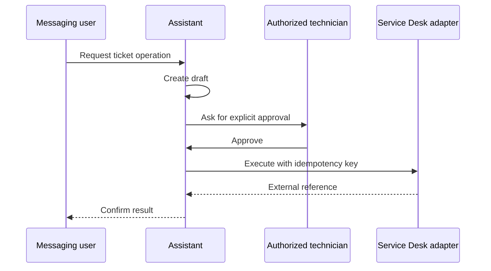

# Conversational IT Service Desk Automation

A clean-room portfolio reference implementation of a messaging-to-ITSM workflow. It demonstrates how a conversational assistant can prepare ticket operations while requiring explicit human approval before any external write.

## What it demonstrates

- Typed actions for ticket creation, replies and resolution.
- Role-based approval policy.
- Explicit state machine: draft → pending approval → approved → executed.
- Idempotency keys for safe retries.
- Append-only JSONL audit events.
- Adapter boundary that keeps vendor APIs outside the domain layer.
- A deterministic demo adapter that makes no network calls.



## Run

```bash
python3 -m venv .venv
source .venv/bin/activate
pip install -e .
python -m unittest discover -s tests -v
uvicorn servicedesk_demo.app:app --reload
```

The API uses `DemoAdapter`, so it cannot create a real ticket. Implement `ServiceDeskAdapter` only for a system you are authorized to access, store tokens outside the repository and retain the human-approval boundary.

## Privacy and scope

This repository was written as a clean-room demonstration. It contains no WhatsApp IDs, employee names, client names, ticket numbers, tokens, proprietary API helpers or copied operational logs. “WhatsApp” is used descriptively; this project is not affiliated with Meta or an ITSM vendor.
